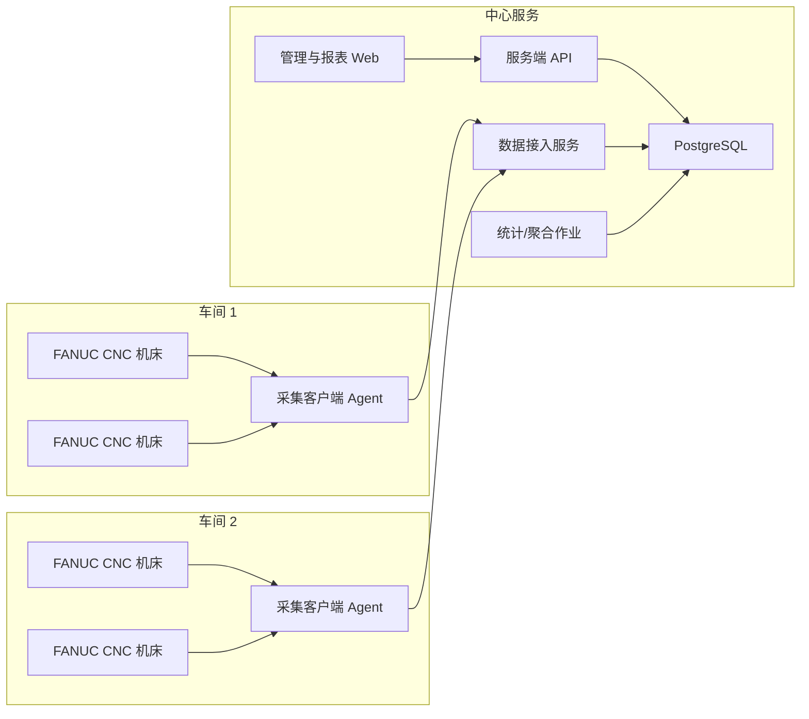

# 机床数采系统总体方案（第一版）

## 1. 目标

面向 5 个机械加工车间、150+ 台机床，并预留后续扩容能力，自建一套可持续演进的数采系统，核心目标如下：

1. 支持服务端 + 客户端架构，机床采集点可无限制扩展。
2. 解决现有 DNC 类软件采集不稳定、数据断点、数据不准的问题。
3. 数据库结构简洁、查询快、后续新增指标成本低。
4. 报表支持“公式配置化”，而不是把统计口径写死在代码里。
5. 当前先支持 FANUC 0i 系列车床场景，后续可扩到其他 CNC/PLC/设备协议。

---

## 2. 关键判断

### 2.1 不建议再以“传统 DNC 软件思路”继续演进

你现在遇到的问题，本质上通常不是“界面不好用”，而是架构有问题：

1. 采集与程序传输混在一起。
2. 由中心端直接跨车间长连接大量机床，任何网络波动都会形成断点。
3. 没有本地缓存，网络断一下就直接丢数。
4. 没有质量标记，采到了什么、缺了什么、补了什么不可追踪。
5. 统计依赖原始点位直接拼报表，导致既慢又不准确。

### 2.2 推荐采用“边缘采集 + 中央服务”的工业数采架构

不让中心服务器直接去“硬连” 150 多台机床，而是在每个车间放一个采集客户端节点，负责本车间机床采集、缓存、重传、心跳和告警。

这样做的核心收益：

1. 机床到采集客户端的链路变短，稳定性明显提升。
2. 车间到中心服务器即使短时中断，也不会丢数。
3. 采集故障可以定位到“某台机床 / 某个车间 / 某个客户端节点”。
4. 后续扩到 300 台、500 台时，不需要推倒重来。

---

## 3. 推荐总体架构



### 3.1 服务端

建议拆为 4 个逻辑模块：

1. `管理服务`
   负责机床、点位、采集模板、公式、报表、权限管理。
2. `数据接入服务`
   负责接收客户端上报数据、去重、落库、质量标记。
3. `统计计算服务`
   负责状态时长汇总、班次汇总、日报/月报、公式计算。
4. `Web 管理端`
   用于配置机床、查看在线状态、查看报表、编辑统计公式。

### 3.2 客户端

每个车间部署 1 套采集客户端，作为 Windows Service 长驻运行：

1. 机床连接管理
2. 按采集频率轮询
3. 本地 SQLite 持久化缓存
4. 断网重连与补传
5. 心跳、日志、质量检测

### 3.3 技术栈建议

结合 FANUC 采集特性，建议：

1. 客户端：`.NET 8 Worker Service + Windows Service`
2. FANUC 驱动：`FOCAS DLL 封装 + P/Invoke`
3. 服务端：`ASP.NET Core Web API`
4. 数据库：`PostgreSQL 16`
5. 管理前端：`Vue 3`
6. 客户端本地缓存：`SQLite (WAL 模式)`

这样选型的原因：

1. FANUC FOCAS 在 Windows 侧集成最稳妥。
2. .NET 对 Windows Service、P/Invoke、Web API、后台任务都比较成熟。
3. PostgreSQL 对时间序列、聚合、分区表、JSON 扩展都够用，而且运维成本比多库组合更低。

---

## 4. FANUC 机床接入策略

### 4.1 第一优先：FOCAS over Ethernet

你列出的主流型号：

1. FANUC Series 0i Mate-TC
2. FANUC Series 0i-T
3. FANUC Series 0i-TF
4. FANUC Series 0i-TF Plus
5. FANUC Series 0i Mate-TD

建议第一阶段统一按 `FANUC FOCAS 以太网采集` 设计。

原因：

1. 官方支持通过 Ethernet 连接 FOCAS。
2. 0i-F 系列官方资料明确支持 Embedded Ethernet。
3. FANUC 官方现成监控产品本身也是基于 Ethernet 做大规模采集。

### 4.2 需要提前确认的现实问题

即使控制器型号相同，机床厂家的 PMC 地址、宏变量约定、状态位定义也可能不同。因此工程上必须把“协议能力”和“机床点位映射”分开。

建议分 3 层：

1. `协议驱动层`
   只负责 FOCAS/PMC/宏变量读取，不关心业务含义。
2. `机床模板层`
   定义一类机床有哪些标准点位，比如电源、运行、报警、程序号、主轴负载等。
3. `派生指标层`
   由原始点位计算开机时间、运行时间、利用率、停机时间等。

### 4.3 采集点分类

建议把采集点分成 4 类：

1. `状态点`
   例如：开机、自动运行、手动、报警、急停、循环启动、进给保持。
2. `计数点`
   例如：工件计数、循环次数、程序次数。
3. `测量点`
   例如：主轴转速、进给倍率、主轴负载、温度、电流。
4. `文本点`
   例如：当前程序号、当前程序名、报警文本、操作者信息。

### 4.4 当前阶段建议优先采集的数据

先做最有业务价值且最容易标准化的一批：

1. 开机状态
2. 自动运行状态
3. 报警状态
4. 急停状态
5. 当前程序号 / 程序名
6. 当前模式（AUTO / MDI / JOG 等）
7. 主轴转速
8. 进给倍率
9. 工件计数
10. 开机累计时间
11. 自动运行累计时间
12. 切削累计时间
13. 报警历史

说明：

1. “开机时间、运行时间”优先建议同时采集“累计计时器”和“状态变化事件”。
2. 如果某些老机型的累计计时器不可直接读，则由状态事件在服务端精确累加。

---

## 5. 稳定性设计（这是本项目成败关键）

“完全不掉线”在工业现场不能口头保证，但可以通过架构把问题收敛成：

1. 断了能自动恢复。
2. 断了不丢数。
3. 缺口可追踪。
4. 数据质量可审计。

### 5.1 稳定性设计原则

1. `本地先落盘，再上传`
   客户端采到的数据先写 SQLite，再异步上传服务端。
2. `上传幂等`
   同一批数据重复上报不会重复入库。
3. `采集与上传解耦`
   服务端慢、网络抖动，不影响车间侧继续采集。
4. `状态按事件存储`
   状态不需要每秒重复保存 1 次，只在变化时落事件。
5. `数值按频率存储`
   高频点和低频点分组采集，避免无意义压力。
6. `每台机床独立 worker`
   单台机床异常不会拖垮整个客户端。

### 5.2 客户端抗抖动机制

每台机床连接器都要具备：

1. 连接超时控制
2. 自动重连
3. 指数退避
4. 抖动随机化
5. 失败熔断
6. 心跳探测
7. 数据质量标记
8. 断点续传

### 5.3 缺口管理

服务端必须有“缺口检测”能力：

1. 多久没有收到某机床数据
2. 哪些点位连续失败
3. 哪些时间段是补传数据
4. 哪些时间段无法补齐，只能标记为空洞

不要做“悄悄丢数”，而要做“可见的缺口”。

### 5.4 现场网络建议

软件架构只能解决一部分问题，现场网络也必须一起规范：

1. 机床全部固定 IP
2. 采集网与办公网逻辑隔离
3. 车间侧交换机不要和办公流量混跑
4. 采集客户端主机关闭睡眠、自动更新重启
5. 全部节点统一 NTP 对时
6. 每个车间建议独立采集主机，不建议一台电脑跨 5 个车间直连全部设备

---

## 6. 数据库设计

原则：`主数据简单、时序数据分层、查询走汇总、原始数据可追溯`

### 6.1 主数据表

#### `collector_nodes`

采集客户端节点信息。

关键字段：

1. `id`
2. `code`
3. `name`
4. `workshop`
5. `ip`
6. `status`
7. `last_heartbeat_at`

#### `machines`

机床主表。

关键字段：

1. `id`
2. `code`
3. `name`
4. `workshop`
5. `brand`
6. `model`
7. `protocol_type`
8. `ip`
9. `port`
10. `collector_node_id`
11. `enabled`

#### `machine_point_defs`

机床点位定义表，支持无限扩展。

关键字段：

1. `id`
2. `machine_id`
3. `point_code`
4. `point_name`
5. `value_type`
6. `collect_mode`
7. `collect_interval_ms`
8. `driver_address`
9. `source_type`
10. `is_standard`
11. `enabled`

说明：

1. `driver_address` 可以存 FOCAS 参数编号、PMC 地址、宏变量号等。
2. `source_type` 用来区分 FOCAS 状态、参数、PMC、宏变量、派生点。

### 6.2 时序数据表

#### `point_samples_num`

数值型采样表。

关键字段：

1. `machine_id`
2. `point_def_id`
3. `sample_time`
4. `value_num`
5. `quality_code`
6. `source_seq`
7. `ingest_time`

#### `point_samples_text`

文本型采样表。

关键字段：

1. `machine_id`
2. `point_def_id`
3. `sample_time`
4. `value_text`
5. `quality_code`
6. `source_seq`
7. `ingest_time`

#### `machine_state_events`

状态变化事件表。

关键字段：

1. `machine_id`
2. `state_code`
3. `state_value`
4. `start_time`
5. `end_time`
6. `duration_ms`
7. `quality_code`

说明：

1. “开机、运行、报警、待机、停机”优先落事件，不建议全部按秒打点。
2. 这样报表计算快、存储量小、准确率更高。

### 6.3 最新值缓存表

#### `point_latest_values`

只保留每个点当前最新值，给大屏和列表秒开使用。

### 6.4 报表与公式表

#### `metric_defs`

定义指标，如利用率、开机率、运行率、报警率。

关键字段：

1. `id`
2. `metric_code`
3. `metric_name`
4. `unit`
5. `scope_type`
6. `enabled`

#### `metric_formula_versions`

公式版本表。

关键字段：

1. `id`
2. `metric_def_id`
3. `version_no`
4. `formula_expr`
5. `effective_from`
6. `effective_to`

#### `metric_results`

统计结果表，按小时 / 班次 / 日 / 月保存结果。

### 6.5 性能策略

1. 时序表按月分区。
2. 高频查询走 `point_latest_values`。
3. 报表不直接扫原始表，优先扫 `machine_state_events` 和 `metric_results`。
4. 原始表索引重点放在 `(machine_id, point_def_id, sample_time desc)`。
5. 时间范围大查询增加 `BRIN` 索引。

---

## 7. 公式化报表设计

### 7.1 不把“利用率”写死

你提到的需求是对的，系统不能把利用率、稼动率、运行率写死，因为每家工厂口径都不一样。

建议做一个“受控公式引擎”：

1. 允许配置公式
2. 允许版本管理
3. 允许按车间 / 机型 / 设备组定义不同公式
4. 允许设置生效时间

### 7.2 公式引擎不要直接开放 SQL

建议使用 DSL 表达式，而不是直接让用户写 SQL。

例如：

```text
利用率 = duration("RUN") / nullif(duration("POWER_ON"), 0) * 100
开机率 = duration("POWER_ON") / nullif(shift_duration(), 0) * 100
报警率 = duration("ALARM") / nullif(duration("POWER_ON"), 0) * 100
```

内置函数建议：

1. `duration(state_code)`
2. `count(point_code)`
3. `sum(point_code)`
4. `avg(point_code)`
5. `max(point_code)`
6. `min(point_code)`
7. `shift_duration()`
8. `if()`
9. `nullif()`
10. `round()`

### 7.3 公式执行策略

1. 公式先解析成 AST
2. AST 再编译成安全 SQL
3. 对小时 / 班次结果先预聚合
4. 日报、月报基于预聚合继续算

这样做的好处：

1. 安全
2. 性能稳定
3. 公式可审计
4. 同一指标允许不同版本并存

---

## 8. 可扩展性设计

### 8.1 点位无限扩展

机床新增点位时，不改表结构，只新增：

1. 点位定义
2. 驱动地址
3. 采集频率
4. 值类型
5. 派生规则

### 8.2 协议扩展

当前先做 `FANUC FOCAS`，后续驱动层预留接口：

1. `ICollectDriver`
2. `FocasDriver`
3. `OpcUaDriver`
4. `ModbusTcpDriver`
5. `MitsubishiDriver`
6. `SiemensDriver`

### 8.3 业务扩展

后续可逐步增加：

1. OEE
2. 班次管理
3. 报警通知
4. 工单绑定
5. 程序版本管理
6. 设备健康监测
7. API 对接 MES / ERP / BI

---

## 9. 推荐实施阶段

### 阶段 1：样机验证（2 到 3 周）

目标：

1. 先选 3 到 5 台机床做打样
2. 覆盖至少 2 种不同 FANUC 型号
3. 打通 FOCAS 连接、状态读取、计时读取、报警读取
4. 验证数据稳定性和点位可得性

交付：

1. 采集点清单
2. 机床连接测试报告
3. 样机数据准确性比对报告
4. 第一版点位模板

### 阶段 2：最小可用系统 MVP（4 到 6 周）

目标：

1. 完成服务端、客户端、数据库、基础 Web
2. 完成 20 到 30 台设备接入
3. 完成开机 / 运行 / 报警 / 程序 / 工件计数采集
4. 完成缺口检测、重传、基础报表

交付：

1. 可安装的服务端
2. 可安装的客户端
3. 设备管理页面
4. 在线状态页
5. 班次 / 日报表

### 阶段 3：全厂推广（4 到 8 周）

目标：

1. 覆盖 150+ 台设备
2. 优化采集模板
3. 完成公式引擎
4. 完成权限、审计、备份、告警

### 阶段 4：深度集成

目标：

1. 对接 MES / ERP
2. 打通工单和产量
3. 实现更完整的 OEE 和异常分析

---

## 10. 我建议的第一版工程目录

```text
DataCollector/
  docs/
  src/
    DataCollector.Agent/
    DataCollector.Agent.Focas/
    DataCollector.Server.Api/
    DataCollector.Server.Worker/
    DataCollector.Domain/
    DataCollector.Infrastructure/
    DataCollector.FormulaEngine/
    DataCollector.Web/
  deploy/
  scripts/
  tests/
```

---

## 11. 这套方案能解决什么，不能解决什么

### 能解决的

1. 大规模设备接入
2. 断网不丢数
3. 点位可扩展
4. 公式可配置
5. 报表口径可版本化
6. 故障可定位
7. 后续扩协议时不用推倒重来

### 不能凭软件单独解决的

1. 某些老机床未开通 Ethernet/FOCAS 选件
2. 某些机床厂未提供 PMC 地址说明
3. 某些指标在控制器里本身不存在，只能通过状态推导
4. 现场网络和交换机质量太差
5. 机床控制器自身死机或关机期间不存在历史缓存

---

## 12. 目前最需要你确认的事项

1. 这 150+ 台设备是否全部已经接入局域网，并且都有固定 IP？
2. 这些 FANUC 机床是否都已经开通 FOCAS / Embedded Ethernet 相关能力？
3. 你们现场是否能接受“每个车间部署 1 台采集主机”的方式？
4. 目前最优先必须采集的前 10 个点位是什么？
5. 你们要的“运行时间”口径，是自动运行时间、切削时间，还是主轴运转时间？
6. 工件计数是 CNC 内可直接读取，还是要从 PMC / 外部信号取？
7. 服务端准备部署在 Windows Server 还是 Linux 虚拟机？
8. 你们后续是否需要对接 MES / ERP / BI？

---

## 13. 我对下一步的建议

下一步不要直接上来开发全系统，先做一件事：

`先拿 3 到 5 台代表性机床做“可采性验证 + 点位摸底”`

这是因为同样是 FANUC 0i，真正决定采集是否顺利的，往往不是型号名，而是：

1. 机床厂家是否开放对应信号
2. PMC 地址怎么定义
3. 现场网络是否规范
4. 机床是否装了相关选件

只有这一步做完，后面的系统设计和编码才能一次性做对。

---

## 14. 参考依据（官方）

以下内容用于支撑本方案中的关键判断：

1. FANUC 官方说明 FOCAS Library 可通过 Ethernet 连接 CNC：
   [FANUC CNC Options for Customisation](https://www.fanuc.eu/eu-en/cnc-options-customisation)
2. FANUC 官方 0i-F 资料列出 `Embedded Ethernet`：
   [FANUC Series 0i-F Brochure](https://www.fanucamerica.com/docs/default-source/cnc-files/brochures/fanuc-cnc-series-0i-f.pdf?sfvrsn=572fca1e_2)
3. FANUC 官方 FASConnect 说明其支持 `all new and legacy FOCAS-enabled FANUC CNCs`，并采用 client/server 方式：
   [FOCAS Automation Brochure](https://www.fanucamerica.com/docs/default-source/cnc-files/brochures/fassolutions-brochure.pdf?sfvrsn=e03a809d_0)
4. 截至 2026-03-17，我查到 FANUC 官方说明 MT-LINK i 可监控 `1 到 2000` 台设备：
   [FANUC MT-LINK i](https://www.fanucamerica.com/products/cnc/cnc-software/machine-tool-data-collection-software/cnc-machine-monitoring-software-mtlink-i)
5. 截至 2026-03-17，我查到 FANUC 官方说明 MT-LINK i 已结束开发，后续为 FIELD system Basic Package，并支持 `REST-API / CSV / 宏变量读写`：
   [FIELD system Basic Package - MT-LINK i integration and migration](https://www.fanuc.co.jp/en/product/field/basic/mtlinki/)
