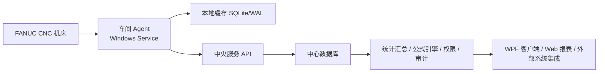

# 企业生产版实施方案

## 1. 总体架构

正式生产版采用：

- `车间 Agent + 中央服务 + 正式客户端`

## 2. 各组件职责

### 2.1 Agent 要干什么

- 负责采集本车间机床
- 负责和 FANUC FOCAS 通信
- 负责原生 timer、原生事件优先采集
- 负责本地先落盘
- 负责断线补传
- 负责给每条数据打质量标记
- 负责和中央服务同步配置、设备主数据、公式版本

### 2.2 中央服务要干什么

- 统一管理设备档案、车间、Agent 节点
- 提供设备增删改查 API
- 提供日报、时间线、角色权限、公式配置 API
- 接收 Agent 上传的数据并幂等入库
- 做报表汇总、班次汇总、公式计算
- 记录操作审计、公式版本和权限变更

### 2.3 客户端要干什么

- 首页显示设备管理总览
- 查看每个车间设备数量和当前状态
- 维护设备信息
- 查看日报统计
- 配置开机率、利用率公式
- 查看单台设备某一天的时间轴
- 管理用户、角色、权限

## 3. 为什么比传统 DNC 更稳

传统中心直连的问题：

- 机房到车间网络一抖就断采
- 服务端一忙就空白
- 中央轮询过多设备时抖动明显
- 网络异常容易被误统计成关机

这套架构的改进点：

- 采集在车间完成，链路更短
- 数据先写 Agent 本地缓存
- 中央服务短时不可用不会造成直接丢数
- 上传恢复后自动补传
- `通信中断` 和 `关机` 分开建模
- 报表优先基于 CNC 原生 timer/counter，不依赖轮询猜测

## 4. 如何把准确性做到接近 100%

### 4.1 原则

- 原生累计值优先
- 原生事件优先
- 推导值可追溯
- 质量标记必须保留

### 4.2 落地策略

1. `A 类数据`
   开机时间、切削时间、运转时间、循环时间、程序加工时间  
   必须优先来自 FANUC 原生 timer/counter。

2. `B 类数据`
   报警号、报警文本、程序切换、模式切换  
   必须按事件化方式存储。

3. `C 类数据`
   主轴转速、负载、倍率、当前程序、在线状态  
   可以轮询，但要记录采样时间。

4. `D 类数据`
   开机率、利用率、等待时间、待机时间  
   必须由公式配置计算，且记录公式版本。

### 4.3 质量标记建议

- `native_timer_first`
  原生计时优先
- `native_event_first`
  原生事件优先
- `fallback_derived`
  原生点位不可用，使用推导值
- `network_gap_isolated`
  存在通信空洞，但已经和关机分离

## 5. 部署方式

### 5.1 车间层

每个车间建议 1 台 Agent 主机：

- Windows 10/11 或 Windows Server
- SSD
- 16GB 内存起
- 双网卡优先
- 网卡 1 接机床网
- 网卡 2 接公司网

### 5.2 机房层

中央服务建议：

- Windows Server 2022/2025 或 Linux
- 数据库优先 PostgreSQL 或 SQL Server 2022
- 通过 HTTPS 发布 API
- 配置定时备份、日志归档、NTP 校时

### 5.3 客户端层

- 主管、IT 运维、管理人员使用 WPF 客户端
- 后续可演进成 Web 管理台

## 6. 数据库设计原则

正式入库不要走“一页一个表”的思路，而是拆成：

- `device`
  设备主数据
- `agent_node`
  Agent 节点
- `machine_status_event`
  状态事件表
- `alarm_event`
  报警事件表
- `program_event`
  程序切换与程序加工事件
- `raw_metric_sample`
  原始快照
- `daily_summary`
  日汇总
- `shift_summary`
  班次汇总
- `formula_definition`
  公式定义及版本
- `user / role / permission / audit_log`
  权限与审计

## 7. 当前这版代码的定位

当前 `enterprise` 工程已经提供：

- 正式版项目拆分
- 服务端 API 骨架
- WPF 客户端页面骨架
- Agent Windows Service 骨架
- 公式引擎和时间统计核心

当前还没有接入正式数据库和正式 FANUC C# 驱动，所以它现在是：

- `正式版架构和界面骨架`
- `不是最终采集上线版`

现有 Python 版本继续保留，用于当前阶段现场验证和口径打样。

## 8. 推荐实施顺序

1. 先用 Python 版继续把单机真实点位和口径打准
2. 在 C# Agent 中接入 FANUC FOCAS 驱动
3. 将服务端仓储替换为正式数据库
4. 完成认证、审计、幂等上传、补传链路
5. 先试点 1 个车间，再铺到 5 个车间
